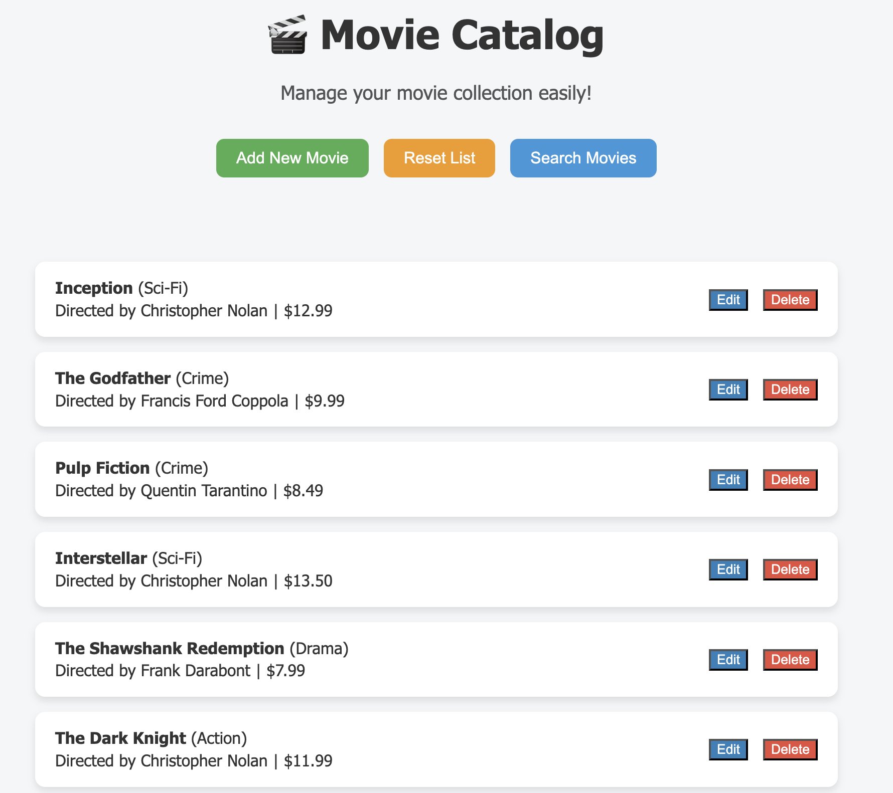

# 🎬 Movie Inventory Application

A **Movie Inventory** web application built with **Node.js**, **Express**, **EJS**, and **PostgreSQL**.  
Manage movies: add new movies, edit, delete, reset the database, and search by title.

[Live Now](https://inventory-application-5uqj.onrender.com/)

---

## 🚀 Features

- Add new movies with details: title, genre, director, and price.  
- Edit existing movies and update details.  
- Delete individual movies or reset the entire movie list.  
- Search movies by title (case-insensitive).  
- Modern responsive UI with separate CSS for each page.

---

## 🛠 Tech Stack

- **Backend:** Node.js, Express  
- **Frontend:** EJS templates, CSS  
- **Database:** PostgreSQL  
- **Deployment:** Render (or any other cloud provider)

---

## ✨ Usage

- **Homepage:** List of movies with options to edit, delete, or reset the table.
- **Add New Movie:** Click "Add New Movie" → fill the form → submit.
- **Edit Movie:** Click "Edit" next to a movie → update fields → submit.
- **Delete Movie:** Click "Delete" next to a movie → confirm.
- **Reset Table:** Click "Reset Data" → confirm.
- **Search Movies:** Click "Search Movie" → enter title → press enter.

## 💡 Notes

- Prices are restricted to **2 decimal places** and maximum `$99.99`.
- Search is **case-insensitive**.
- Each page has a dedicated **CSS file** for styling.
- Environment variables are stored in **.env** (Render supports this for deployment).
